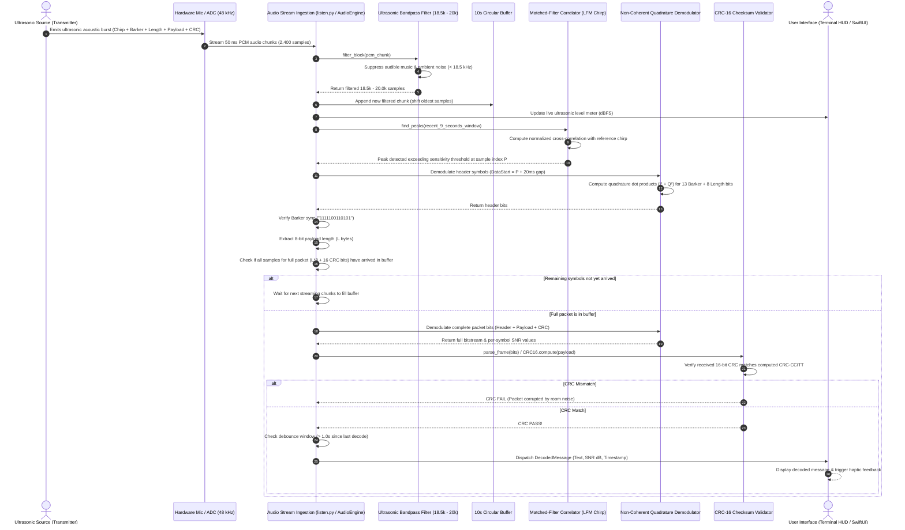

# SonicWave Receiver Architecture & Technical Specification 🎧📱

This document provides a comprehensive technical breakdown of the **SonicWave Receiver subsystem**. It details how silent ultrasonic acoustic waves ($18.5\text{ kHz} - 20.0\text{ kHz}$) are captured via microphone hardware (desktop PortAudio or iOS `AVAudioEngine`), isolated from ambient room acoustics and music, synchronized via matched-filter chirp correlation, demodulated with non-coherent quadrature tone energy detection, validated with CRC-16 integrity checks, and presented to the user.

---

## 1. High-Level System Architecture

The receiver operates as a streaming real-time digital signal processing (DSP) pipeline that ingests continuous PCM audio chunks, isolates the ultrasonic channel, detects packet preambles, demodulates frequency-shifted data symbols, and reconstructs binary text messages.

```mermaid
graph TD
    MicDiaphragm["Acoustic Pressure Waves<br/><i>Room Air Transmissions</i>"] --> MicHardware["Hardware Microphone & ADC<br/><code>48 kHz, 16/24-bit PCM</code>"]
    MicHardware --> AudioStream["Streaming Audio Ingestion<br/><code>listen.py / SonicWaveAudioEngine.swift</code>"]
    
    subgraph IsolationEngine ["1. Ultrasonic Channel Isolation"]
        AudioStream --> Bandpass["Bandpass Filter (18.5 kHz - 20.0 kHz)<br/><i>Python: 8th-Order Butterworth SOS<br/>iOS: Direct Form II Transposed Biquad</i>"]
        Bandpass --> CircularBuf["Sliding Circular Ring Buffer<br/><code>10.0 Seconds (480,000 samples)</code>"]
        Bandpass --> LevelMeter["RMS Energy dBFS Level Meter<br/><code>Apple Accelerate vDSP / NumPy</code>"]
    end

    subgraph SyncEngine ["2. Preamble Detection & Timing Sync"]
        CircularBuf --> MatchedFilter["Matched-Filter Cross-Correlation<br/><i>Normalized cross-correlation with reference chirp<br/>γ(t) = |(x ★ s)| / √(Ex · Es)</i>"]
        MatchedFilter --> ThresholdCheck{"Correlation Peak<br/>γ ≥ Threshold?<br/>(default: 0.20-0.35)"}
        ThresholdCheck -- No --> CircularBuf
        ThresholdCheck -- Yes --> BarkerSync["Barker 13-bit Sync & Header Decoder<br/><code>1111100110101</code> (tolerates ≤ 2-3 bit errors)"]
    end

    subgraph DemodEngine ["3. Dynamic Demodulation Engine"]
        BarkerSync --> LengthExtract["Dynamic Length Header (8 bits)<br/><i>Extracts payload byte count (1..64 bytes)</i>"]
        LengthExtract --> CompletenessCheck{"Full Packet In Buffer?<br/><i>Samples ≥ DataStart + TotalBits * Nsym</i>"}
        CompletenessCheck -- No --> CircularBuf
        CompletenessCheck -- Yes --> QuadratureDemod["Non-Coherent 2-FSK Quadrature Energy<br/><i>Center 80% symbol window (avoids boundary ringing)<br/>E0 = I0² + Q0² (18.8 kHz) | E1 = I1² + Q1² (19.6 kHz)</i>"]
        QuadratureDemod --> BitDecision["Bit Decision & SNR Estimator<br/><code>bit = 1 if E1 > E0 else 0<br/>SNR = 10 · log10(max(E0,E1) / min(E0,E1))</code>"]
    end

    subgraph IntegrityEngine ["4. Frame Integrity & Presentation"]
        BitDecision --> CRCValidation["CRC-16-CCITT Verification<br/><code>poly=0x1021, init=0xFFFF</code>"]
        CRCValidation --> CRCResult{"Received CRC<br/>== Computed CRC?"}
        CRCResult -- Fail --> LogFail["Log CRC Mismatch (Discard)"]
        CRCResult -- Pass --> Debounce["Debounce Filter<br/><i>Suppresses duplicates within 1.0 - 1.5 s</i>"]
        Debounce --> Presentation["User Presentation<br/><i>Terminal HUD (listen.py)<br/>Native SwiftUI App (SonicWaveReceiver)</i>"]
    end
```

---

## 2. Signal Processing & Data Flow Diagram

---

## 3. Detailed File-by-File Breakdown

### Python Receiver Subsystem (`receiver/`)

#### `1. receiver/sonicwave/config.py`
- **Purpose**: Defines system-wide acoustic parameters, sample rates, frequencies, and packet structure constants.
- **Key Parameters**:
  - `sample_rate`: $48,000\text{ Hz}$ standard consumer audio rate.
  - `carrier_freq`: $19,200\text{ Hz}$ ultrasonic carrier.
  - `f0`, `f1`: $18,800\text{ Hz}$ (Bit 0) and $19,600\text{ Hz}$ (Bit 1) with an $800\text{ Hz}$ tone separation.
  - `symbol_duration_sec`: $0.020\text{ s}$ ($20\text{ ms} = 50\text{ baud}$).
  - `chirp_duration_sec`: $0.060\text{ s}$ ($60\text{ ms}$ LFM up-chirp from $18.5\text{ kHz}$ to $19.9\text{ kHz}$).
  - `barker_code`: `"1111100110101"` ($13\text{ bits}$).
  - `filter_lowcut`, `filter_highcut`: $18,500\text{ Hz}$ and $20,000\text{ Hz}$.

#### `2. receiver/sonicwave/demodulation.py`
- **Purpose**: Houses the core mathematical DSP classes for filtering, preamble detection, quadrature demodulation, and streaming buffer management.
- **Key Classes & Methods**:
  - `UltrasonicBandpassFilter`:
    - `__init__(config)`: Configures an 8th-order Butterworth bandpass filter using Second-Order Sections (SOS) for numerical stability near the Nyquist frequency.
    - `filter_block(audio_block)`: Filters incoming streaming chunks while preserving internal delay state (`zi`) between successive calls to prevent boundary transients.
    - `filter_all(audio)`: Single-pass offline filtering for complete audio files.
  - `MatchedFilterDetector`:
    - `__init__(config)`: Precomputes the reference LFM synchronization chirp and calculates its total energy for fast normalization.
    - `find_peaks(filtered_audio, min_threshold)`: Calculates normalized cross-correlation $\gamma(t)$ using FFT convolution against incoming audio, detects peaks exceeding the threshold, and returns chirp end indices.
  - `FSKDemodulator`:
    - `__init__(config)`: Precomputes cosine and sine basis vectors for $f_0$ and $f_1$ across one symbol duration.
    - `decode_symbol(symbol_samples)`: Samples the center $80\%$ of the symbol window to eliminate transition ringing, integrates in-phase ($I$) and quadrature ($Q$) projections, calculates power ($E = I^2 + Q^2$), and decides bit value ($1$ if $E_1 > E_0$ else $0$).
    - `demodulate_stream(audio, start_idx, max_bits)`: Sequentially decodes symbols from a given start index and computes the average signal-to-noise ratio in dB.
  - `StreamReceiver`:
    - `__init__(config, on_payload_decoded)`: Initializes DSP filters, a $10.0\text{ s}$ circular buffer ($480,000\text{ samples}$), and debounce tracking.
    - `process_block(block)`: Ingests audio blocks, updates the circular buffer, searches for preambles, verifies Barker sync, dynamically reads payload length, waits for complete packet arrival, validates CRC-16, debounces, and triggers the payload callback.

#### `3. receiver/sonicwave/framing.py`
- **Purpose**: Packet framing, deserialization, Barker synchronization validation, and CRC-16-CCITT computation.
- **Key Functions**:
  - `crc16_ccitt(data, poly=0x1021, init=0xFFFF) -> int`:
    Computes a 16-bit CRC across payload bytes using bitwise shifts and XOR polynomial reduction, providing $>99.998\%$ detection reliability against transmission errors.
  - `build_frame(payload, config) -> List[int]`:
    Constructs an ordered bitstream: `[Barker 13b] + [Length 8b] + [Payload N*8b] + [CRC16 16b]`.
  - `parse_frame(bits, config) -> Tuple[bool, Optional[bytes], str]`:
    Extracts Barker sync (tolerating $\le 2$ bit flips), decodes 8-bit packet length, reassembles payload bytes MSB-first, verifies 16-bit CRC checksum, and returns status.

#### `4. receiver/listen.py`
- **Purpose**: Real-time microphone listening application with live ASCII ultrasonic level meter.
- **Key Functions**:
  - `on_message_decoded(payload_bytes, snr_db)`:
    Prints formatted reception banner with timestamp, decoded UTF-8 string, measured SNR in dB, and byte count.
  - `run_listener(profile_type, device_index)`:
    Opens a non-blocking PortAudio microphone stream (`sounddevice.InputStream`) in $50\text{ ms}$ blocks, feeds samples into `StreamReceiver`, computes instantaneous ultrasonic RMS dBFS, and animates a terminal VU meter.

#### `5. receiver/test_roundtrip.py`
- **Purpose**: Automated end-to-end verification script for continuous stream demodulation.
- **Key Functions**:
  - `test_file_roundtrip(wav_file)`:
    Reads an encoded composite WAV file (music + ultrasonic data), chunks it into $50\text{ ms}$ blocks to simulate real-time microphone streaming, feeds them through `StreamReceiver`, and validates that the payload decodes with $100\%$ accuracy and positive SNR.

---

### Native iOS Receiver Subsystem (`receiver/ios/SonicWaveReceiver/`)

#### `1. SonicWaveDSPCore.swift`
- **Purpose**: Core digital signal processing engine written in Swift utilizing Apple's Accelerate framework for high-performance vectorized operations.
- **Key Methods**:
  - `init()`: Sets up circular buffer, generates reference LFM chirp with $5\text{ ms}$ Hann taper, and precomputes quadrature basis vectors for $18.8\text{ kHz}$ and $19.6\text{ kHz}$.
  - `updateSampleRate(_ newFs)`: Dynamically reconfigures the DSP core when hardware sample rate changes (e.g., between $44.1\text{ kHz}$ and $48\text{ kHz}$).
  - `bandpassFilter(_ input)`: Direct Form II Transposed Second-Order Section (Biquad) IIR filter ($18.5\text{ kHz} - 20.0\text{ kHz}$) optimized for Apple Silicon.
  - `processAudioBuffer(_ rawSamples)`: Ingests raw audio from the input tap, filters it, computes RMS dBFS using `vDSP_rmsqv`, updates the $10\text{ s}$ circular buffer, and triggers detection.
  - `detectAndDecode(in searchWindow, currentRMSDB)`: Runs cross-correlation via `vDSP_conv`, finds peaks, validates 13-bit Barker sync, extracts 8-bit length header, confirms full packet symbol presence, locks sync, and invokes demodulation.
  - `demodulateBits(from audio, startIdx, bitCount)`: Vectorized quadrature dot products using Apple Accelerate `vDSP_dotpr` on $80\%$ center symbol slices, computing tone powers and per-symbol SNR.
  - `validateAndDispatch(allBits, length, snrList, peakIndex)`: Reassembles payload bytes, validates CRC-16-CCITT, debounces duplicate packets within $1.0\text{ s}$, creates a `DecodedMessage`, and notifies the UI on the main thread.

#### `2. SonicWaveAudioEngine.swift`
- **Purpose**: Hardware audio pipeline manager interfacing `AVFoundation` with `SonicWaveDSPCore`.
- **Key Methods**:
  - `startAudioStream()`: Configures `AVAudioSession` with `.playAndRecord` category and `.measurement` mode (disabling iOS non-linear speech AGC and noise suppression filters), sets preferred sample rate to $48\text{ kHz}$, installs a real-time tap on `audioEngine.inputNode`, and starts the audio engine.
  - `stopListening()`: Tears down the input tap, stops `AVAudioEngine`, deactivates the audio session, and updates state.
  - `toggleListening()`: Manages user toggle requests with permission checks.
  - `requestPermissionAndStart()`: Checks and requests iOS microphone record permission (`AVAudioSession.sharedInstance().requestRecordPermission`).

#### `3. CRC16.swift`
- **Purpose**: Fast 16-bit CRC-CCITT implementation in Swift matching the transmitter and Python receiver (`poly=0x1021, init=0xFFFF`).

#### `4. DecodedMessage.swift`
- **Purpose**: Immutable Swift data model representing a successfully received message, containing UUID, decoded text, raw byte array, reception timestamp, SNR in dB, and CRC validity.

#### `5. ContentView.swift`
- **Purpose**: Modern SwiftUI user interface featuring dark glassmorphism cards, animated ultrasonic VU meter with warning thresholds, sensitivity threshold slider, live scrolling logs, and decoded message history with one-tap copy.

---

## 4. Mathematical Foundations & DSP Theory

### 1. Ultrasonic Bandpass Filtering
To suppress ambient speech, room noise, and music below $18\text{ kHz}$, incoming samples are filtered through a bandpass filter centered around $19.2\text{ kHz}$.
In iOS, this is implemented as a Direct Form II Transposed Biquad:
$$w[n] = x[n] - a_1 w[n-1] - a_2 w[n-2]$$
$$y[n] = b_0 w[n] + b_1 w[n-1] + b_2 w[n-2]$$

In Python, an 8th-order Butterworth filter implemented in Second-Order Sections (SOS) provides a steep roll-off with maximum numerical stability near the Nyquist frequency.

### 2. Matched-Filter Cross-Correlation
The receiver detects the $60\text{ ms}$ Linear Frequency Modulated (LFM) up-chirp $s(t)$ ($18.5\text{ kHz} \to 19.9\text{ kHz}$) using normalized cross-correlation:
$$\gamma(t) = \frac{\left| \int_{0}^{T} x(t + \tau) s(\tau) d\tau \right|}{\sqrt{\int_{0}^{T} x^2(t + \tau) d\tau \cdot \int_{0}^{T} s^2(\tau) d\tau}}$$

Where:
- $\gamma(t) \in [0, 1]$ is the normalized correlation coefficient.
- The numerator is evaluated via FFT convolution (`signal.fftconvolve` in Python) or vectorized time-domain convolution (`vDSP_conv` in Swift).
- Processing Gain:
  $$G_p = 10 \log_{10}(B \cdot T) = 10 \log_{10}(1400\text{ Hz} \cdot 0.060\text{ s}) \approx 19.2\text{ dB}$$
  This $19.2\text{ dB}$ processing gain enables reliable detection even when the acoustic signal is buried beneath ambient room noise.

### 3. Non-Coherent Quadrature Tone Energy Demodulation
Because transmitter and receiver clocks are unsynchronized, the receiver uses non-coherent quadrature detection:
$$I_k = \sum_{n=0}^{N-1} x[n] \cos\left(2\pi f_k \frac{n}{F_s}\right), \quad Q_k = \sum_{n=0}^{N-1} x[n] \sin\left(2\pi f_k \frac{n}{F_s}\right)$$
$$E_k = I_k^2 + Q_k^2 \quad \text{for } k \in \{0, 1\}$$

- **Bit Decision**:
  $$\hat{b} = \begin{cases} 1 & \text{if } E_1 > E_0 \\ 0 & \text{if } E_0 \ge E_1 \end{cases}$$
- **Windowing**: Only the center $80\%$ of the symbol ($n \in [0.1 N, 0.9 N]$) is evaluated to avoid edge transitions and acoustic reverberation ringing.

### 4. Signal-to-Noise Ratio (SNR) Estimation
For each symbol, the instantaneous SNR is computed from the ratio of signal power to noise power:
$$\text{SNR}_{\text{symbol}} = 10 \log_{10}\left( \frac{\max(E_0, E_1)}{\max(\min(E_0, E_1), \epsilon)} \right)$$
The packet average SNR is the arithmetic mean across all received symbols.

### 5. Cyclic Redundancy Check (CRC-16-CCITT)
The payload integrity is protected by polynomial division in Galois field $\text{GF}(2)$:
$$P(x) = x^{16} + x^{12} + x^5 + 1 \quad (\mathtt{0x1021})$$
A single-bit error anywhere in the payload changes the computed CRC with $100\%$ probability; multi-bit burst errors up to 16 bits are detected with $100\%$ certainty, and longer random errors with $>99.998\%$ certainty.

---

## 5. Acoustic & Receiver Specification Reference Table

| Parameter | Value | Rationale & Description |
|:---|:---|:---|
| **Audio Sample Rate ($F_s$)** | $48,000\text{ Hz}$ | Standard ADC sampling rate across macOS, iOS, Windows, and Linux. |
| **Nyquist Frequency** | $24,000\text{ Hz}$ | Upper frequency limit of the digital sampling system. |
| **Ultrasonic Passband** | $18,500\text{ Hz} - 20,000\text{ Hz}$ | Isolates transmission channel while blocking audible music and room noise. |
| **Tone 0 ($f_0$)** | $18,800\text{ Hz}$ | Binary 0 frequency. |
| **Tone 1 ($f_1$)** | $19,600\text{ Hz}$ | Binary 1 frequency. |
| **Tone Separation ($\Delta f$)** | $800\text{ Hz}$ | Eliminates spectral overlap and Doppler shift interference. |
| **Symbol Duration ($T_{sym}$)** | $20\text{ ms}$ ($960\text{ samples}$) | $50\text{ baud}$ transmission speed ($50\text{ bps}$). |
| **Center Integration Window** | $80\%$ ($16\text{ ms} = 768\text{ samples}$) | Discards $10\%$ on each edge to suppress transition multipath ringing. |
| **Preamble Chirp Duration** | $60\text{ ms}$ ($2,880\text{ samples}$) | LFM up-chirp ($18.5\text{ kHz} \to 19.9\text{ kHz}$) providing $19.2\text{ dB}$ processing gain. |
| **Correlation Threshold** | $0.20 - 0.35$ | Tunable sensitivity threshold for room acoustics and air attenuation. |
| **Barker Sync Code** | `1111100110101` ($13\text{ bits}$) | Optimal autocorrelation code; receiver tolerates $\le 2-3$ bit flips. |
| **Length Header** | $8\text{ bits}$ ($0 - 64\text{ bytes}$) | Enables dynamic variable-length packet transmission. |
| **Error Detection** | CRC-16-CCITT (`0x1021`) | 16-bit error detection guarantee over all payload bytes. |
| **Circular Buffer Size** | $10.0\text{ s}$ ($480,000\text{ samples}$) | Accommodates long transmission bursts and dynamic reception windows. |
| **Debounce Interval** | $1.0\text{ s} - 1.5\text{ s}$ | Prevents multiple detections of the same physical acoustic chirp. |
