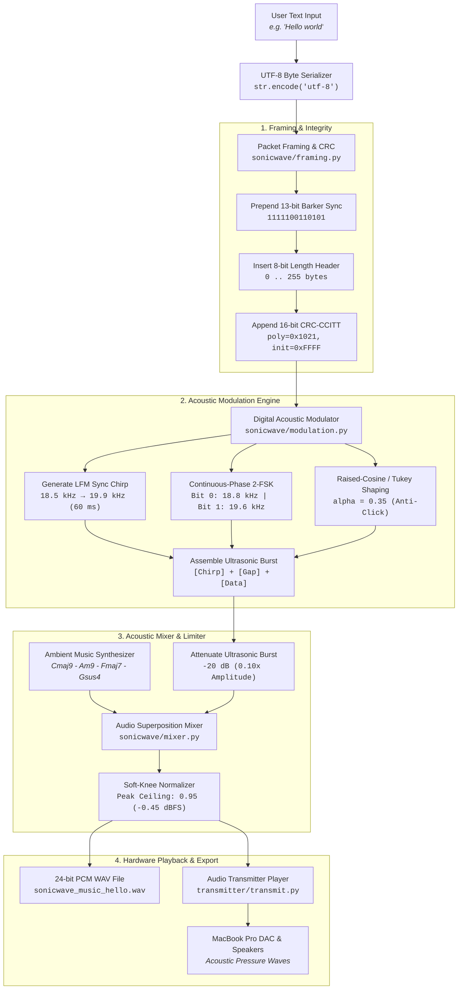
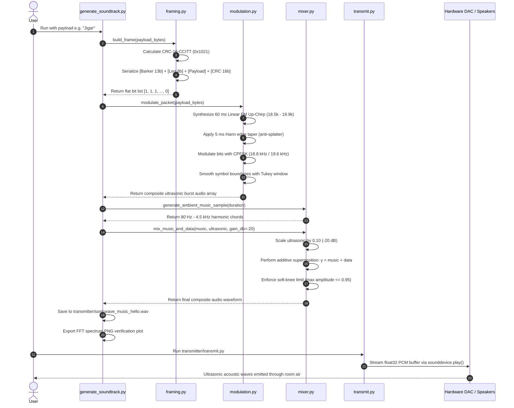

# SonicWave Transmitter Architecture & Technical Specification 📡🔊

This document provides a comprehensive technical breakdown of the **SonicWave Transmitter subsystem**. It details how raw human text is converted into silent, ultrasonic acoustic pressure waves, embedded seamlessly into audible background music, and transmitted through laptop or external speakers without distortion or audible clicks.

---

## 1. High-Level System Architecture

The transmitter operates as a multi-stage pipeline converting high-level application data into continuous physical audio samples.

---

## 2. Signal Processing & Data Flow Diagram

---

## 3. Detailed File-by-File Breakdown

### `1. transmitter/sonicwave/config.py`
- **Purpose**: Single source of truth for all physical, hardware, timing, and DSP constants.
- **Key Classes**:
  - `ProfileType` (Enum): Distinguishes `UNIVERSAL_48K` (iPhone/Mac compatible) from `HD_96K` (pro studio audio).
  - `SonicConfig` (Dataclass):
    - `sample_rate`: $48,000\text{ Hz}$ (standard consumer DAC rate).
    - `carrier_freq`: $19,200\text{ Hz}$ (inaudible to adults, within iPhone mic range).
    - `f0`, `f1`: $18,800\text{ Hz}$ (Bit 0) and $19,600\text{ Hz}$ (Bit 1), providing $\Delta f = 800\text{ Hz}$ tone separation.
    - `symbol_duration_sec`: $0.020\text{ s}$ ($20\text{ ms} = 50\text{ baud} = 50\text{ bps}$).
    - `chirp_duration_sec`: $0.060\text{ s}$ ($60\text{ ms} = 2,880\text{ samples}$ sweep from $18.5\text{ kHz}$ to $19.9\text{ kHz}$).
    - `barker_code`: `"1111100110101"` ($13\text{ bits}$).
    - `ultrasonic_gain_db`: $-20.0\text{ dB}$ ($10\%\text{ linear amplitude}$ of background music).
    - `peak_limit`: $0.95$ (headroom ceiling to prevent digital clipping).

---

### `2. transmitter/sonicwave/framing.py`
- **Purpose**: Handles binary serialization, frame packetization, and mathematical integrity checks.
- **Key Functions**:
  - `crc16_ccitt(data: bytes, poly=0x1021, init=0xFFFF) -> int`:
    Computes a 16-bit Cyclic Redundancy Check across all payload bytes using bitwise shifts and XOR operations. Detects burst errors, bit flips, and ambient interference with $>99.998\%$ reliability.
  - `build_frame(payload: bytes, config: SonicConfig) -> List[int]`:
    Converts raw text bytes into an ordered bitstream:
    1. **13-bit Barker Sync**: Establishes bit synchronization on the receiver.
    2. **8-bit Length Header**: Encodes payload byte count ($0$ to $255$), enabling variable-length packets.
    3. **Payload Bits**: Serializes each character byte MSB-first.
    4. **16-bit CRC Checksum**: Appends the 16-bit error-checking code MSB-first.

---

### `3. transmitter/sonicwave/modulation.py`
- **Purpose**: Translates digital bits into physical acoustic analog waveform samples.
- **Key Functions**:
  - `generate_sync_chirp() -> np.ndarray`:
    Synthesizes a Linear Frequency Modulated (LFM) up-chirp. The instantaneous frequency sweeps linearly:
    $$f(t) = f_{start} + \frac{f_{end} - f_{start}}{T} \cdot t$$
    Integrating angular frequency yields the phase:
    $$\phi(t) = 2\pi \left( f_{start} \cdot t + \frac{f_{end} - f_{start}}{2T} \cdot t^2 \right)$$
    A $5\text{ ms}$ Hann edge window is applied to the onset and tail to eliminate spectral splatter.
  - `modulate_bits_fsk(bits: List[int]) -> np.ndarray`:
    Implements **Continuous-Phase 2-FSK (CPFSK)**. For each $20\text{ ms}$ symbol, it synthesizes either $f_0$ ($18.8\text{ kHz}$) or $f_1$ ($19.6\text{ kHz}$). It preserves the carrier phase:
    $$\phi_{next} = (\phi_{current} + 2\pi f \cdot N_{sym} / F_s) \pmod{2\pi}$$
    This guarantees zero phase jumps across symbol boundaries, eliminating audible clicks. A Tukey/Hann pulse-shaping window ($\alpha=0.35$) softens transitions.
  - `modulate_packet(payload: bytes, gap_sec=0.02) -> np.ndarray`:
    Combines the preamble chirp, a $20\text{ ms}$ silence guard band, the CPFSK modulated data symbols, and trailing silence into a single contiguous audio burst.

---

### `4. transmitter/sonicwave/mixer.py`
- **Purpose**: Generates carrier music, applies ultrasonic attenuation, and performs additive superposition.
- **Key Functions**:
  - `generate_ambient_music_sample(duration_sec, sample_rate) -> np.ndarray`:
    Synthesizes a pleasant ambient chord progression (Cmaj9 $\to$ Am9 $\to$ Fmaj7 $\to$ Gsus4) with fundamental, 2nd, and 3rd harmonics confined to $80\text{ Hz} - 4.5\text{ kHz}$, providing natural masking for the ultrasonic data.
  - `mix_music_and_data(music, ultrasonic_data, config, offset_sec=1.0) -> np.ndarray`:
    Calculates the linear attenuation factor:
    $$A_{data} = 10^{\frac{\text{ultrasonic\_gain\_db}}{20}} = 10^{\frac{-20}{20}} = 0.10$$
    Performs additive superposition:
    $$y(t) = x_{music}(t) + A_{data} \cdot x_{data}(t - t_{offset})$$
    Applies soft-knee peak limiting to guarantee $\max |y(t)| \le 0.95$ (preventing DAC clipping).

---

### `5. transmitter/generate_soundtrack.py`
- **Purpose**: Command-line orchestration tool to generate composite soundtrack WAV files and diagnostic plots.
- **Key Functions**:
  - `generate_soundtrack(...)`:
    1. Parses user text (e.g. `--payload "Jigar"`).
    2. Synthesizes the modulated ultrasonic packet.
    3. Generates or loads the background music track.
    4. Mixes both tracks and exports a studio-grade 24-bit PCM WAV (`sonicwave_music_hello.wav`).
    5. Computes an FFT (Fast Fourier Transform) and exports a frequency spectrum verification plot (`sonicwave_music_hello_spectrum.png`).

---

### `6. transmitter/transmit.py`
- **Purpose**: Hardware playback transmitter streaming the soundtrack through speakers.
- **Key Functions**:
  - `play_soundtrack(file_path, loop=False, loop_delay=2.0)`:
    - Automatically resolves relative paths to find `transmitter/sonicwave_music_hello.wav`.
    - Queries the system DAC (e.g., MacBook Pro Speakers).
    - Uses non-blocking PortAudio streaming (`sounddevice.play`).
    - Renders a live terminal progress bar updated every $100\text{ ms}$.
    - Supports continuous transmission loops with configurable delays (`--loop --delay 3.0`).
    - Handles `KeyboardInterrupt` (Ctrl+C) gracefully without audio pops.

---

## 4. Acoustic & Hardware Parameters Reference Table

| Parameter | Value | Rationale |
|:---|:---|:---|
| **Audio Sample Rate ($F_s$)** | $48,000\text{ Hz}$ | Universal standard across iOS, macOS, Windows, and Android hardware. |
| **Nyquist Limit ($F_s / 2$)** | $24,000\text{ Hz}$ | Maximum theoretical analog frequency before aliasing occurs. |
| **Center Carrier Frequency** | $19,200\text{ Hz}$ | Inaudible to adult humans, well within the linear passband of smartphone microphones. |
| **Tone 0 ($f_0$)** | $18,800\text{ Hz}$ | Represents binary 0. |
| **Tone 1 ($f_1$)** | $19,600\text{ Hz}$ | Represents binary 1. |
| **Tone Separation ($\Delta f$)** | $800\text{ Hz}$ | Prevents tone collision in multipath acoustic room reverberation. |
| **Symbol Duration ($T_{sym}$)** | $20\text{ ms}$ ($0.020\text{ s}$) | 50 bits/second transmission rate. Optimal compromise between speed and room echo resilience. |
| **Preamble Chirp** | $18.5\text{ kHz} \to 19.9\text{ kHz}$ ($60\text{ ms}$) | Linear FM sweep providing matched-filter cross-correlation processing gain. |
| **Barker Code** | `1111100110101` ($13\text{ bits}$) | Optimal mathematical autocorrelation (side-lobes $\le 1$). |
| **CRC Checksum** | CRC-16-CCITT (`0x1021`) | Guarantees error-free message validation. |
| **Ultrasonic Gain** | $-20.0\text{ dB}$ ($0.10\times$ amplitude) | Prevents acoustic speaker coil distortion and audible intermodulation. |
| **Peak Limiter** | $0.95$ ($-0.45\text{ dBFS}$) | Prevents digital clipping on hardware DAC output. |
